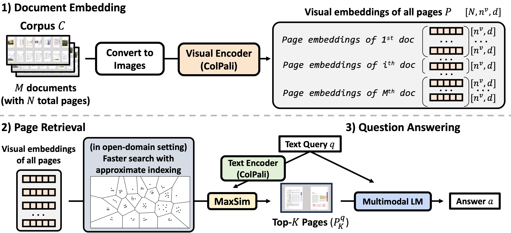

# M3DocRAG

Code for [M3DocRAG: Multi-modal Retrieval is What You Need for Multi-page Multi-document Understanding](https://m3docrag.github.io/)

by [Jaemin Cho](https://j-min.io/)¹, [Debanjan Mahata](https://sites.google.com/a/ualr.edu/debanjan-mahata/)², [Ozan İrsoy](https://wtimesx.com/)², [Yujie He](https://scholar.google.com/citations?user=FbeAZGgAAAAJ&hl=en)², and [Mohit Bansal](https://www.cs.unc.edu/~mbansal/)¹

¹UNC Chapel Hill <br>
²Bloomberg

# Summary

## Abstract

Document visual question answering (DocVQA) pipelines that answer questions from documents have broad applications. Existing methods focus on handling single-page documents with multi-modal language models (MLMs), or rely on text-based retrieval-augmented generation (RAG) that uses text extraction tools such as optical character recognition (OCR). However, there are difficulties in applying these methods in real-world scenarios: (a) questions often require information across different pages or documents, where MLMs cannot handle many long documents; (b) documents often have important information in visual elements such as figures, but text extraction tools ignore them. We introduce M3DocRAG, a novel multi-modal RAG framework that flexibly accommodates various document contexts (closed-domain and open-domain), question hops (single-hop and multi-hop), and evidence modalities (text, chart, figure, etc.). M3DocRAG finds relevant documents and answers questions using a multi-modal retriever and an MLM, so that it can efficiently handle single or many documents while preserving visual information. Since previous DocVQA datasets ask questions in the context of a specific document, we also present M3DocVQA, a new benchmark for evaluating open-domain DocVQA over 3,000+ PDF documents with 40,000+ pages. In three benchmarks (M3DocVQA/MMLongBench-Doc/MP-DocVQA), empirical results show that M3DocRAG with ColPali and Qwen2-VL 7B achieves superior performance than many strong baselines, including state-of-the-art performance in MP-DocVQA. We provide comprehensive analyses of different indexing, MLMs, and retrieval models. Lastly, we qualitatively show that M3DocRAG can successfully handle various scenarios, such as when relevant information exists across multiple pages and when answer evidence only exists in images.

## Comparison with previous approches


Comparison of multi-modal document understanding pipelines: Previous works focus on (a) **Single-page DocVQA** that cannot handle many long documents or (b) **Text-based RAG** that ignores visual information. Our (c) **M3DocRAG** framework retrieves relevant documents and answers questions using multi-modal retrieval and MLM components so that it can efficiently handle many long documents, while preserving visual information.

## M3DocRAG framework



Our **M3DocRAG** framework consists of three stages: (1) document embedding, (2) page retrieval, and (3) question answering.
- In (1) document embedding, we extract visual embedding (with ColPali) to represent each page from all PDF documents.
- In (2) page retrieval, we retrieve the top-K pages of high relevance (MaxSim scores) with text queries. In an open-domain setting, we create approximate page indices for faster search.
- In (3) question answering, we conduct visual question answering with multi-modal LM (e.g., Qwen2-VL) to obtain the final answer.


# Setup

## Package

We assume Conda has been installed:

```bash
git clone <REPO_URL>
cd m3docrag-release
pip install -e .

# Install Poppler (for pdf2image; check [https://pdf2image.readthedocs.io/en/latest/installation.html](https://pdf2image.readthedocs.io/en/latest/installation.html) for details)
# conda install -y poppler
# or
# apt-get install poppler-utils
```

## Code structure

```bash
examples/               # scripts to run PDF embedding / RAG
src/m3docrag/
    datasets/           # data loader for existing datasets
    retrieval/          # retrieval model (e.g., ColPaLi)
    vqa/                # vqa model (e.g., Qwen2-VL)
    rag/                # RAG model that combines retrieval and VQA models
    utils/              # misc utility methods
m3docvqa/               # how to set up the M3DocVQA dataset
```
## Paths: Data, Embeddings, Model checkpoints, Outputs

```bash
# in .env
LOCAL_DATA_DIR="/job/datasets" # where to store data
LOCAL_EMBEDDINGS_DIR="/job/embeddings" # where to store embeddings
LOCAL_MODEL_DIR="/job/model" # where to store model checkpoints
LOCAL_OUTPUT_DIR="/job/output" # where to store model outputs
```

You can adjust variables in [`.env`](.env) to change where to store data/embeddings/model checkpoints/outputs by default. They are loaded in [`src/m3docrag/utils/paths.py`](./src/m3docrag/utils/paths.py) via [python-dotenv](https://github.com/theskumar/python-dotenv).

## Download the M3DocVQA dataset

Please see [m3docvqa/README.md](m3docvqa/README.md) for the download instructions.

## Download model checkpoints

By default, we use ColPali-v1.2 for retrival and Qwen2-VL-7B-Instruct for question answering.

At `$LOCAL_MODEL_DIR`, download [ColPali-v1.2](https://huggingface.co/vidore/colpali-v1.2), [colpaligemma-3b-mix-448-base](https://huggingface.co/vidore/colpaligemma-3b-mix-448-base), and [Qwen2-VL-7B-Instruct](https://huggingface.co/Qwen/Qwen2-VL-7B-Instruct) checkpoints.

```bash
cd $LOCAL_MODEL_DIR

git clone https://huggingface.co/vidore/colpaligemma-3b-pt-448-base # ColPali backbone
git clone https://huggingface.co/vidore/colpali-v1.2 # ColPali adapter
git clone https://huggingface.co/Qwen/Qwen2-VL-7B-Instruct # VQA
```

# Example usage

Below, we describe examples of the usage of M3DocRAG on the M3DocVQA dataset.

## 1. Extract PDF embeddings

```bash
DATASET_NAME="m3-docvqa"
RETRIEVAL_MODEL_TYPE="colpali"
RETRIEVAL_MODEL_NAME="colpaligemma-3b-pt-448-base"
RETRIEVAL_ADAPTER_MODEL_NAME="colpali-v1.2"
SPLIT="dev"
EMBEDDING_NAME=$RETRIEVAL_ADAPTER_MODEL_NAME"_"$DATASET_NAME"_"$SPLIT  # where to save embeddings
accelerate launch --num_processes=1 --mixed_precision=bf16 examples/run_page_embedding.py \
    --use_retrieval \
    --retrieval_model_type=$RETRIEVAL_MODEL_TYPE \
    --data_name=$DATASET_NAME \
    --split=$SPLIT \
    --loop_unique_doc_ids=True \
    --output_dir=/job/embeddings/$EMBEDDING_NAME \
    --retrieval_model_name_or_path=$RETRIEVAL_MODEL_NAME \
    --retrieval_adapter_model_name_or_path=$RETRIEVAL_ADAPTER_MODEL_NAME    
```

## 2. Indexing

```bash
DATASET_NAME="m3-docvqa"
RETRIEVAL_MODEL_TYPE="colpali"
RETRIEVAL_ADAPTER_MODEL_NAME="colpali-v1.2"
SPLIT="dev"
FAISS_INDEX_TYPE='ivfflat'
EMBEDDING_NAME=$RETRIEVAL_ADAPTER_MODEL_NAME"_"$DATASET_NAME"_"$SPLIT
INDEX_NAME=$EMBEDDING_NAME"_pageindex_"$FAISS_INDEX_TYPE # where to save resulting index
echo $EMBEDDING_NAME
echo $FAISS_INDEX_TYPE
python examples/run_indexing_m3docvqa.py \
    --use_retrieval \
    --retrieval_model_type=$RETRIEVAL_MODEL_TYPE \
    --data_name=$DATASET_NAME \
    --split=$SPLIT \
    --loop_unique_doc_ids=False \
    --embedding_name=$EMBEDDING_NAME \
    --faiss_index_type=$FAISS_INDEX_TYPE \
    --output_dir=/job/embeddings/$INDEX_NAME
```

## 3. RAG

```bash
BACKBONE_MODEL_NAME="Qwen2-VL-7B-Instruct"
RETRIEVAL_MODEL_TYPE="colpali"
RETRIEVAL_MODEL_NAME="colpaligemma-3b-pt-448-base"
RETRIEVAL_ADAPTER_MODEL_NAME="colpali-v1.2"
EMBEDDING_NAME="colpali-v1.2_m3-docvqa_dev" # from Step 1 Embedding
SPLIT="dev"
DATASET_NAME="m3-docvqa"
FAISS_INDEX_TYPE='ivfflat'
N_RETRIEVAL_PAGES=1
INDEX_NAME="${EMBEDDING_NAME}_pageindex_$FAISS_INDEX_TYPE" # from Step 2 Indexing
OUTPUT_SAVE_NAME="${RETRIEVAL_ADAPTER_MODEL_NAME}_${BACKBONE_MODEL_NAME}_${DATASET_NAME}" # where to save RAG results
BITS=16 # BITS=4 for 4-bit qunaitzation in low memory GPUs
python examples/run_rag_m3docvqa.py \
    --use_retrieval \
    --retrieval_model_type=$RETRIEVAL_MODEL_TYPE \
    --load_embedding=True \
    --split=$SPLIT \
    --bits=$BITS \
    --n_retrieval_pages=$N_RETRIEVAL_PAGES \
    --data_name=$DATASET_NAME \
    --model_name_or_path=$BACKBONE_MODEL_NAME \
    --embedding_name=$EMBEDDING_NAME \
    --retrieval_model_name_or_path=$RETRIEVAL_MODEL_NAME \
    --retrieval_adapter_model_name_or_path=$RETRIEVAL_ADAPTER_MODEL_NAME \
    --output_dir=/job/eval_outputs/$OUTPUT_SAVE_NAME
```

# Citation

Please cite our paper if you use our dataset and/or method in your projects.

```bibtex
@article{Cho2024M3DocRAG,
  author    = {Jaemin Cho and Debanjan Mahata and Ozan İrsoy and Yujie He and Mohit Bansal},
  title     = {M3DocRAG: Multi-modal Retrieval is What You Need for Multi-page Multi-document Understanding},
  year      = {2024},
}
```
