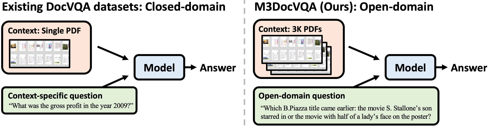
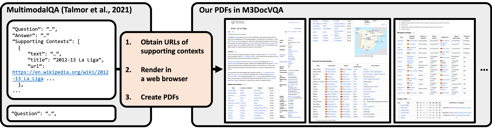

# M3DocVQA

Dataset generation package for [M3DocRAG: Multi-modal Retrieval is What You Need for Multi-page Multi-document Understanding.](https://m3docrag.github.io/)

## Summary

M3DocVQA (Multi-modal Multi-page Multi-Document Visual Question Answering) is a new benchmark for evaluating open-domain DocVQA over 3,000+ PDF documents with 40,000+ pages. M3DocVQA significantly raises the challenge of DocVQA to answering questions from a large document corpus (Sec. 3). By extending the MultimodalQA dataset’s closed-domain context to an open-domain setting, M3DocVQA introduces 2,441 multi-hop questions spanning 3,368 PDF documents, which collectively contain over 41,005 pages of diverse multi-modal content, including text, images, and tables. The dataset generated presents real-world challenges by requiring models to navigate complex reasoning paths across pages and within various types of document elements, better reflecting the intricacies of document understanding.



Comparison of existing DocVQA datasets (left: e.g., DocVQA) and the generated `M3DocVQA` dataset (right). In contrast to previous DocVQA datasets that have questions that are specific to a single provided PDF (e.g., `What was the gross profit in the year 2009?`), M3DocVQA contains information-seeking questions that benchmark open-domain question answering capabilities across more than `3,000 PDF documents` (i.e., `40,000+ pages`).



We extend the question-answer pairs from a short-context VQA dataset to a more complex setting that includes:
1. PDF documents.
2. Open-domain contexts.

We first collect the URLs of all supporting contexts (Wikipedia documents) of individual questions of [MultimodalQA](https://github.com/allenai/multimodalqa). This tool then creates PDF versions from their URLs by rendering them in a Chromium web browser.

## M3DocVQA Dataset Creation Pipeline

This part of the repository provides scripts to create the `M3DocVQA` dataset, including functionalities to download Wikipedia pages as PDFs, check and clean corrupted PDFs, extract images, and organize files into directories for training and evaluation.

### Overview

The scripts allows users to:
- Download Wikipedia pages in either PDF or PNG format.
- Verify and clean downloaded PDFs.
- Extract images from PDFs.
- Organize files into directories based on split information for training/evaluation.

## Installation

```
git clone <url-tbd>
cd <repo-name-tbd>/m3docvqa
```

### Install Python Package

We used Python 3.10.

```bash
pip install -e .
```

### Setup Playwright

```bash
# e.g., download browsers, ffmpeg, etc.
playwright install
playwright install-deps
```

### Test the Package
```bash
pytest tests
```

**Note**: The tests might fail if `poppler-utils` is not installed on your system. You need to make sure you have `poppler-utils` installed for `pdf2image`. Please refer to these [detailed instructions](https://pdf2image.readthedocs.io/en/latest/installation.html).

### Additional Setup
Ensure the required directories and metadata files are available before running the scripts. Continue as directed to get the required data.

## Usage

The main script (`main.py`) supports several actions, each of which targets a specific portion of the dataset creation process.

### Command Structure
```bash
python main.py <action> [options]
```

### Available Actions
- `download_pdfs`: Download PDFs from URLs provided in the metadata.
- `check_pdfs`: Verify if the downloaded PDFs are valid.
- `extract_images`: Extract images from the pages of the downloaded PDFs.
- `organize_files`: Organize downloaded PDFs into specified directory splits.
- `download_mmqa`: Download and decompress the MMQA dataset.
- `generate_wiki_mapping`: Generate a mapping of 'id' to 'url' from multiple JSONL files.

## Steps for Generating the M3DocVQA Dataset

### Step 1: Download the MultiModalQA Dataset
Use the `download_mmqa` action to download and decompress the MultiModalQA dataset files.

```bash
python main.py download_mmqa --output_dir=./multimodalqa
```

Output:
Decompressed JSONL files
```bash
MMQA_train.jsonl
MMQA_dev.jsonl
MMQA_texts.jsonl
MMQA_images.jsonl
MMQA_tables.jsonl
```

These files will be stored in the `./multimodalqa/` directory.

### Step 2: Generate Wiki Mapping
Use the `generate_wiki_mapping` action to create a mapping of `id` to `url` from the downloaded JSONL files.

```bash
python main.py generate_wiki_mapping --text=./multimodalqa/MMQA_texts.jsonl --image=./multimodalqa/MMQA_images.jsonl --table=./multimodalqa/MMQA_tables.jsonl --output=./id_url_mapping.jsonl
```
Output:

A JSONL file `id_url_mapping.jsonl` containing the ID and corresponding URL mappings.

### Step 3: Download Wikipedia Articles as PDFs
Use the `download_pdfs` action to download Wikipedia articles in a PDF format based on the generated mapping.

```bash
python main.py download_pdfs --metadata_path=./id_url_mapping.jsonl --pdf_dir=./pdfs --result_log_path=./download_results.jsonl --first_n=10 --supporting_doc_ids_per_split=./supporting_doc_ids_per_split.json --split=dev
```

Options:
- `--metadata_path`: Path to the id_url_mapping.jsonl file.
- `--pdf_dir`: Directory to save the downloaded PDFs.
- `--result_log_path`: Path to log the download results.
- `--first_n`: Downloads the first N PDFs for testing. **Do not use this option for downloading all the PDFs.**
- `--supporting_doc_ids_per_split`: Path to JSON file containing document IDs for each split. `dev` is the default split, as all of the experimental results in the `M3DocRAG` paper were reported on the `dev` split. Anyone interested in downloading the PDFs in the `train` split can provide `--supporting_doc_ids_per_split=train` as the option. In case anyone is interested in downloading all the PDFs, one can also provide `--supporting_doc_ids_per_split=all` as an option.

Output:

- PDF files for Wikipedia articles, saved in the `./pdfs/` directory.
- A `download_results.jsonl` file logging the status of each download.

### Step 4: Check PDF Integrity
Use the `check_pdfs` action to verify the integrity of the downloaded PDFs.

```bash
python main.py check_pdfs --pdf_dir=./pdfs
```
Output:

Identifies and logs corrupted or unreadable PDFs.

### Step 5: Organize Files into Splits
Use the `organize_files` action to organize the downloaded PDFs into specific splits (e.g., `train`, `dev`) based on a split information file.

```bash
python main.py organize_files --all_pdf_dir=./pdfs --target_dir_base=./splits --split=dev --split_metadata_file=./multimodalqa/MMQA_dev.jsonl
```

If train split is needed:

```bash
python main.py organize_files --all_pdf_dir=./pdfs --target_dir_base=./splits --split=train --split_metadata_file=./multimodalqa/MMQA_train.jsonl
```

Output:

- Organized PDFs into directories in `./splits/pdfs_train/` and `./splits/pdfs_dev/`.
- Files that store document IDs of each split `./train_doc_ids.json` and `./dev_doc_ids.json`.

**Note** - In the [M3DocRAG](https://arxiv.org/abs/2411.04952) paper, we only use the `dev` split for our experiments.

### Step 6: Extract Images from PDFs
Use the `extract_images` action to extract images from the downloaded PDFs. A PNG image of each page of the PDFs is extracted. These images are used for both `retrieval` using `ColPali/ColQwen`, as well as `question answering` using the LLMs mentioned in the [M3DocRAG](https://arxiv.org/abs/2411.04952) paper.

```bash
python main.py extract_images --pdf_dir=./splits/pdfs_dev/ --image_dir=./images/images_dev
```

Output:

Extracted images from the PDFs in the dev split are saved in the `./images/images_dev` directory.

After following these steps, your dataset directory structure will look like this:

```
./
|-- multimodalqa/
|   |-- MMQA_train.jsonl
|   |-- MMQA_dev.jsonl
|   |-- MMQA_texts.jsonl
|   |-- MMQA_images.jsonl
|   |-- MMQA_tables.jsonl
|-- id_url_mapping.jsonl
|-- dev_doc_ids.json
|-- train_doc_ids.json
|-- supporting_doc_ids_per_split.json
|-- download_results.jsonl
|-- pdfs/
|   |-- <article_1>.pdf
|   |-- <article_2>.pdf
|-- images/
|-- |--images_dev/
|   |  |-- <doc_id_1_page_1>.png
|   |  |-- <doc_id_2_page_2>.png
|-- splits/
|   |-- pdfs_dev/
|   |   |-- <doc_id_1>.pdf
|   |   |-- <doc_id_2>.pdf
```
